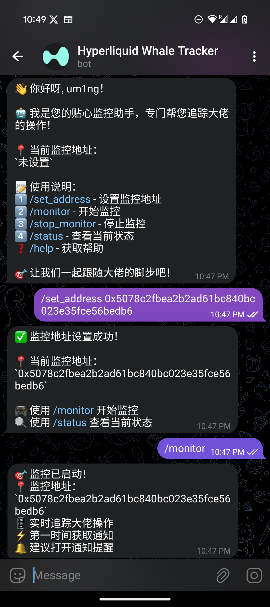

# Hyperliquid ホエールトラッカーボット 🐋

[English](README.md) | [中文](README_CN.md) | 日本語

Hyperliquid DEX（分散型取引所）でのホエール（大口取引者）の取引活動を監視する Telegram ボットです。



## 主な機能

- 🔍 指定されたウォレットアドレスのリアルタイム監視
- 📊 詳細な取引分析（買い/売り、ポジションの開始/終了）
- 💬 Telegram による即時通知
- 🐳 ホエール取引活動の追跡
- 🔄 信頼性の高いエラー処理とリトライメカニズム

## クイックスタート

### 必要条件

- Python 3.8+
- Telegram ボットトークン
- Arbitrum ノードアクセス
- Hyperliquid API アクセス

### インストール

1. リポジトリのクローン
```bash
git clone https://github.com/yourusername/HyperliquidWhaleTrackerBot.git
cd HyperliquidWhaleTrackerBot
```

2. 依存関係のインストール
```bash
python3 -m pip install -r requirements.txt
```

3. 環境変数の設定
```bash
# 環境変数のサンプルファイルをコピー
cp .env.example .env

# .env ファイルを編集して設定を行う
nano .env  # または任意のテキストエディタを使用
```

`.env` ファイルに必要な環境変数：
```bash
# Telegram の設定
TELEGRAM_BOT_TOKEN=あなたのボットトークン    # @BotFather から取得
TELEGRAM_CHAT_ID=あなたのチャットID        # @userinfobot から取得

# ブロックチェーンの設定
ARBITRUM_RPC_URL=あなたのArbitrumRPCURL    # Arbitrum RPC エンドポイント
HYPERLIQUID_API_URL=あなたのHyperliquidAPIURL  # Hyperliquid API エンドポイント
```

### 使用方法

1. ボットの起動
```bash
python3 main.py
```

2. Telegram コマンド
- `/start` - ボットを開始
- `/set_address` - 監視アドレスを設定
- `/monitor` - 監視を開始
- `/stop_monitor` - 監視を停止
- `/status` - 現在のステータスを確認
- `/help` - ヘルプを表示

3. 再起動と停止
- 停止：`Ctrl + C` でスクリプトを停止
- 再起動：`python3 main.py` を再度実行
- バックグラウンドで実行している場合：`ps aux | grep python3` でプロセスを見つけ、`kill <プロセスID>` で停止

## アーキテクチャ

### コアコンポーネント

1. **ブロックチェーンモニター**
   - リアルタイム取引監視
   - 1秒間隔のブロックスキャン
   - 非同期処理

2. **取引プロセッサー**
   - 取引タイプの識別
   - ポジション分析
   - キャッシュメカニズム

3. **通知システム**
   - Telegram 統合
   - フォーマット済みメッセージ
   - エラー処理

## ユースケース

このボットは主に以下の目的で使用されます：
1. 成功している取引者の操作の追跡
2. 取引戦略の学習
3. リアルタイムの市場洞察の取得
4. ホエールの行動パターンの分析

## 貢献

貢献は大歓迎です！Pull Request をお気軽にご提出ください。

1. このリポジトリをフォーク
2. 機能ブランチを作成 (`git checkout -b feature/AmazingFeature`)
3. 変更をコミット (`git commit -m 'Add some AmazingFeature'`)
4. ブランチにプッシュ (`git push origin feature/AmazingFeature`)
5. Pull Request を開く

## ライセンス

このプロジェクトは MIT ライセンスの下で公開されています - 詳細は [LICENSE](LICENSE) ファイルをご覧ください。 